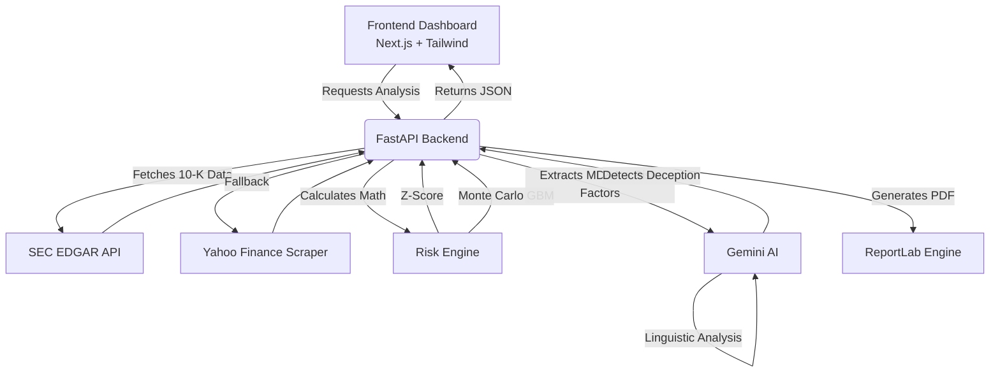

# Alpha-Guard 🛡️

**Forensic Credit Risk Platform**

Alpha-Guard is an institutional-grade financial forensics platform that combines traditional financial modeling (Altman Z-Score, Monte Carlo simulations) with advanced AI linguistic stress analysis to detect deception and assess credit risk in publicly traded companies.

Built by [Tanishq Kalra](https://tanishq-kalra.github.io/portfoliotanishq/) as a demonstration of full-stack engineering, financial modeling, and AI integration capabilities.

---

## 🎯 The Mission

To build a professional-grade forensic credit risk platform that reads between the lines of financial reports. Alpha-Guard doesn't just crunch numbers—it analyzes the semantic sentiment of management discussions to uncover hidden red flags and "Truth Scores."

---

## 🏗️ Architecture Flow



1. **Data Ingestion**: The system pulls live XBRL financial facts and 10-K text filings from the SEC EDGAR database.
2. **Financial Engine**: Calculates the Altman Z-Score and runs a Geometric Brownian Motion (GBM) Monte Carlo simulation to stress-test future revenue.
3. **Forensic AI Layer**: Passes the "Management's Discussion" (MD&A) and "Risk Factors" sections to Google's Gemini AI to analyze linguistic hedging, evasion, and sentiment gaps.
4. **Synthesis**: Correlates the hard math (Z-Score) with the soft language (Truth Score) to raise deception alerts.
5. **Reporting**: Generates a branded executive PDF report.

---

## 🚀 Key Features

*   **Smart Ticker Search**: Real-time autosuggestion for global market access.
*   **Altman Z-Score**: Evaluates 5 core financial ratios to categorize companies into Safe, Gray, or Distress zones.
*   **Forensic AI Audit**: Gemini-powered linguistic analysis extracting hedging scores, evasion scores, and a holistic "Truth Score".
*   **Monte Carlo Stress Test**: 1,000-path revenue simulation using GBM to visualize 5-year percentile bands and decline probabilities.
*   **Executive PDF Reports**: One-click professional report generation via ReportLab.
*   **Premium UI**: "Bloomberg Terminal" aesthetic with glassmorphism, Framer Motion animations, and neon styling.

---

## 💻 Tech Stack

*   **Frontend**: Next.js 14, React, Tailwind CSS, Framer Motion, Recharts
*   **Backend**: Python, FastAPI, Uvicorn, httpx, ReportLab, Pydantic, NumPy
*   **AI & Integrations**: Google Gemini API, SEC EDGAR XBRL Data, Playwright

---

## ⚙️ Installation & Setup

**1. Clone the repository**
```bash
git clone https://github.com/yourusername/Alpha-Guard.git
cd Alpha-Guard
```

**2. Backend Setup (Python 3.10+)**
```bash
cd backend
python -m venv venv
source venv/bin/activate  # On Windows: venv\\Scripts\\activate
pip install -r requirements.txt
```
*Create a `.env` file in the `backend/` directory:*
```ini
GEMINI_API_KEY=your_google_api_key_here
```
*Start the backend server:*
```bash
uvicorn main:app --reload
```
*(The backend runs on `http://localhost:8000`)*

**3. Frontend Setup (Node.js)**
```bash
cd ../frontend
npm install
npm run dev
```
*(The frontend runs on `http://localhost:3000`)*

**4. Access the Platform**
Open `http://localhost:3000` in your browser.

---

*Disclaimer: Alpha-Guard is a conceptual tool for educational and demonstration purposes. It does not provide financial advice.*
