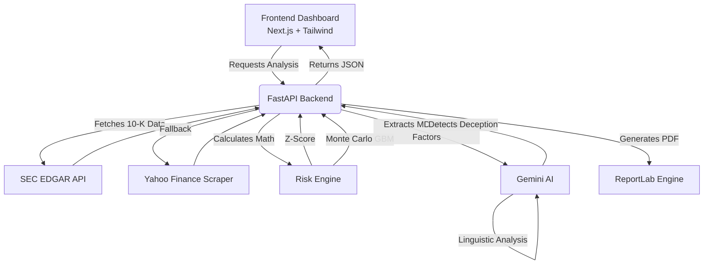

# Alpha-Guard 🛡️

**Forensic Credit Risk Platform**

Alpha-Guard is an institutional-grade financial forensics platform that combines traditional financial modeling (Altman Z-Score, Monte Carlo simulations) with advanced AI linguistic stress analysis to detect deception and assess credit risk in publicly traded companies.

Built as a capstone project by **Tanishq Kalra** (23bce8021), **Priya Pareek** (23bce9243), **Varsha Shekhawat** (23bce7221) and **Dhanishta Sandip Likhar** (23bce9274) — VIT-AP University.

---

## 🎯 The Mission

To build a professional-grade forensic credit risk platform that reads between the lines of financial reports. Alpha-Guard doesn't just crunch numbers—it analyzes the semantic sentiment of management discussions to uncover hidden red flags and "Truth Scores."

---

## 🏗️ Architecture Flow


```mermaid
graph TD
    A[Frontend Dashboard<br/>Next.js + Tailwind] -->|Requests Analysis| B(FastAPI Backend)
    B -->|Fetches 10-K Data| C[SEC EDGAR API]
    B -->|Fallback| D[Yahoo Finance Scraper]
    C --> B
    D --> B
    B -->|Calculates Math| E[Risk Engine]
    E -->|Z-Score| B
    E -->|Monte Carlo GBM| B
    B -->|Extracts MD&A + Risk Factors| F[Gemini AI]
    F -->|Linguistic Analysis| F
    F -->|Detects Deception| B
    B -->|Generates PDF| G[ReportLab Engine]
    B -->|Returns JSON| A
```

1. **Data Ingestion**: Pulls XBRL financial facts from SEC EDGAR, with every metric aligned to the same fiscal year-end, plus market capitalisation from Yahoo Finance (SEC public float as fallback). International tickers use Yahoo Finance.
2. **Financial Engine**: Calculates the Altman Z-Score, choosing the right model variant for the company, and runs a Geometric Brownian Motion (GBM) Monte Carlo simulation to stress-test future revenue.
3. **Forensic AI Layer**: Extracts the MD&A and Risk Factors sections from the latest 10-K (skipping the table of contents and cross-references) and sends the MD&A to Gemini for sentiment and red-flag detection. Every quote Gemini returns is checked against the filing text.
4. **Synthesis**: Combines financial health, filing language, earnings-call candor, narrative consistency and earnings quality into a Truth Score (Credibility Index), and raises a deception alert when a bullish narrative meets a Distress-zone balance sheet.
5. **Reporting**: Generates a branded executive PDF report from the same pipeline.

### Earnings conference call analysis

The latest quarterly earnings call is fetched from the Alpha Vantage transcript API (free key; transcripts cached for 7 days). Without a transcript, US companies fall back to the SEC 8-K Item 2.02 earnings press release.

* **Prepared remarks vs analyst Q&A** — hedging, evasion and tone are measured separately for the scripted CEO/CFO remarks and for executives' unscripted answers.
* **Deflection rate** — share of answers that decline to answer ("we don't break that out", "too early to say", "not going to comment").
* **Tone shift** — Q&A tone minus prepared-remarks tone; a script much rosier than the answers is a warning sign.
* **Call Candor Score** (0–100) — 100 minus penalties for deflections, brief answers, tone drop, heavy hedging, and an upbeat call from a Distress-zone company. Press releases get no Candor Score because they have no Q&A.

Based on Larcker & Zakolyukina (2012), *Detecting Deceptive Discussions in Conference Calls*, Journal of Accounting Research.

### How the scores work

**Altman Z-Score** — the model is picked automatically:

| Company | Model | Formula | Zones (Distress / Safe) |
|---|---|---|---|
| US manufacturer (SIC 2000–3999) | Altman Z (1968) | 1.2·X1 + 1.4·X2 + 3.3·X3 + 0.6·X4 + 1.0·X5, X4 = market cap / liabilities | < 1.81 / > 2.99 |
| Non-manufacturer, international, or no market cap | Altman Z'' (1995) | 6.56·X1 + 3.26·X2 + 6.72·X3 + 1.05·X4, X4 = book equity / liabilities | < 1.10 / > 2.60 |
| Bank, insurer, investment firm (SIC 6000–6799) | — | Not applicable; the API says so instead of returning a misleading score | — |

**Truth Score (Credibility Index)** — a weighted combination of five independent pieces of evidence (0–100 each):

| Component | Weight | Evidence |
|---|---|---|
| Financial health | 30% | Altman Z-Score scaled within its zone (Distress 15–40, Gray 40–70, Safe 70–100) |
| Filing language | 20% | 10-K MD&A: 100 − hedging, evasion and verified-AI-red-flag penalties (see below) |
| Earnings call candor | 20% | Call Candor Score from the latest conference call's analyst Q&A |
| Narrative consistency | 15% | Management's tone in the filing and on the call vs the Z-Score zone (100 consistent, 70 mild optimism, 20 contradiction) |
| Earnings quality | 15% | Sloan (1996) accruals = (net income − operating cash flow) / total assets; profits backed by cash score 100 |

Missing components (e.g. a 10-K without a standard MD&A, or no call transcript) are left out and the remaining weights re-balanced; at least two are required. ≥ 70 Credible · 40–69 Suspicious · < 40 Deceptive.

Filing-language penalties:

| Penalty | Rule | Cap |
|---|---|---|
| Hedging | 1 point per hedging-score point above 15 (normal MD&A prose sits around 13–27) | 30 |
| Evasion | 2 points per evasion-score point above 2 | 25 |
| Red flags | 0.75 × total severity of Gemini's flagged sentences **whose quotes were found in the filing** (only when Gemini is available) | 30 |

Example results (September 2026): AAPL 100, MSFT 97, GOOGL 97, IBM 91 (Credible); Ford 59 (Suspicious — Distress-zone Z-Score with an upbeat earnings call).

---

## 🚀 Key Features

*   **Smart Ticker Search**: Real-time autosuggestion for global market access.
*   **Altman Z-Score**: Original Z or Z'' chosen per company, with component breakdown and Safe / Gray / Distress zones.
*   **Forensic AI Audit**: Gemini-powered linguistic analysis with verified quotes, hedging and evasion scores, and a transparent "Truth Score".
*   **Monte Carlo Stress Test**: 1,000-path revenue simulation (configurable up to 100,000) using GBM to visualize 5-year percentile bands and decline probabilities.
*   **Executive PDF Reports**: One-click professional report generation via ReportLab.
*   **Premium UI**: "Bloomberg Terminal" aesthetic with glassmorphism, Framer Motion animations, and neon styling.

---

## 💻 Tech Stack

*   **Frontend**: Next.js 16, React 19, Tailwind CSS 4, Framer Motion, Recharts
*   **Backend**: Python, FastAPI, Uvicorn, httpx, ReportLab, Pydantic, NumPy, yfinance
*   **AI & Integrations**: Google Gemini API (`google-genai`), SEC EDGAR XBRL & full-text filings, Yahoo Finance

---

## ⚙️ Installation & Setup

**1. Clone the repository**
```bash
git clone https://github.com/yourusername/Alpha-Guard.git
cd Alpha-Guard
```

**2. Backend Setup (Python 3.10+)**
```bash
cd backend
python -m venv venv
source venv/bin/activate  # On Windows: venv\\Scripts\\activate
pip install -r requirements.txt
```
*Create a `.env` file in the `backend/` directory:*
```ini
GEMINI_API_KEY=your_google_api_key_here
GEMINI_MODEL=gemini-flash-latest
SEC_USER_AGENT="Your Name your.email@example.com"   # SEC requires a real contact
ALLOWED_ORIGINS=http://localhost:3000                # comma-separated; "*" allows any
RATE_LIMIT_PER_MINUTE=10                             # audits/PDFs per IP per minute
ALPHAVANTAGE_API_KEY=your_free_key                   # earnings call transcripts
```
See `backend/.env.example` for details.

*Run the tests (no network access needed):*
```bash
pytest
```
*Start the backend server:*
```bash
uvicorn main:app --reload
```
*(The backend runs on `http://localhost:8000`)*

**3. Frontend Setup (Node.js)**
```bash
cd ../frontend
npm install
npm run dev
```
*Set `NEXT_PUBLIC_API_URL=http://localhost:8000` (e.g. in `frontend/.env.local`) to use a local backend; otherwise the deployed Render API is used.*
*(The frontend runs on `http://localhost:3000`)*

**4. Access the Platform**
Open `http://localhost:3000` in your browser.

---

*Disclaimer: Alpha-Guard is a conceptual tool for educational and demonstration purposes. It does not provide financial advice.*
